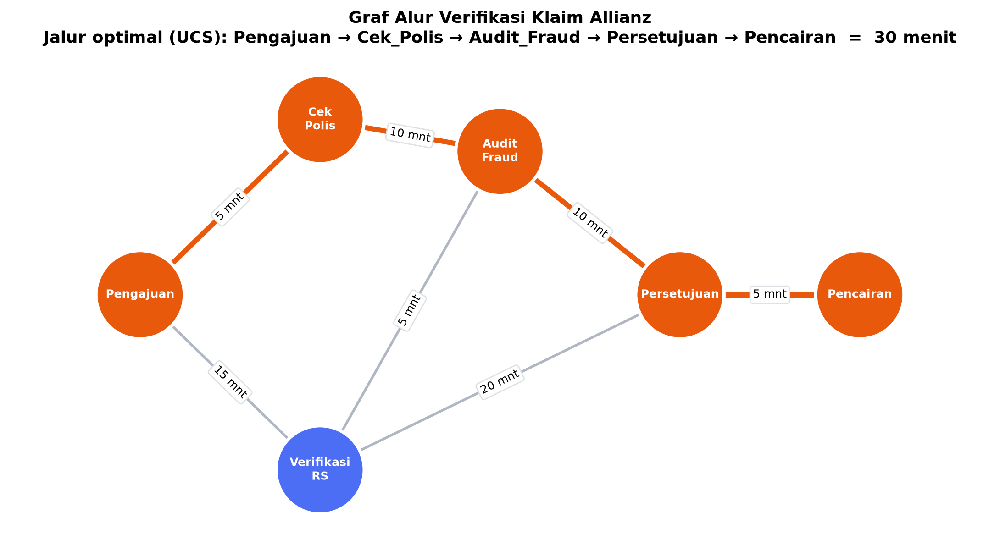

# Tugas 01 Milestone 1: Optimasi Alur Verifikasi Klaim Asuransi dengan Uniform Cost Search

Program ini mencari jalur tercepat pada alur verifikasi klaim asuransi Allianz menggunakan algoritma Uniform Cost Search (UCS), mulai dari tahap pengajuan klaim sampai pencairan dana.

## Deskripsi Masalah

Proses klaim asuransi tidak selalu berjalan lurus dari satu tahap ke tahap berikutnya. Satu klaim bisa melewati beberapa jalur yang berbeda, dan setiap jalur memakan waktu yang berbeda pula.

Alur proses dimodelkan sebagai graf berbobot tak berarah:

- Node: tahapan proses klaim (Pengajuan, Cek Polis, Verifikasi RS, Audit Fraud, Persetujuan, Pencairan)
- Edge: kemungkinan perpindahan antar tahapan
- Bobot: estimasi waktu proses dalam satuan menit

Tujuan program adalah menemukan rangkaian tahapan dari Pengajuan ke Pencairan dengan total waktu paling kecil.

## Struktur Graf

| Dari | Ke | Waktu (menit) |
|---|---|---|
| Pengajuan | Cek_Polis | 5 |
| Pengajuan | Verifikasi_RS | 15 |
| Cek_Polis | Audit_Fraud | 10 |
| Verifikasi_RS | Audit_Fraud | 5 |
| Verifikasi_RS | Persetujuan | 20 |
| Audit_Fraud | Persetujuan | 10 |
| Persetujuan | Pencairan | 5 |

Graf disimpan dalam bentuk adjacency list menggunakan dictionary bersarang:

```python
graph_allianz = {
    'Pengajuan':     {'Cek_Polis': 5, 'Verifikasi_RS': 15},
    'Cek_Polis':     {'Pengajuan': 5, 'Audit_Fraud': 10},
    'Verifikasi_RS': {'Pengajuan': 15, 'Audit_Fraud': 5, 'Persetujuan': 20},
    'Audit_Fraud':   {'Cek_Polis': 10, 'Verifikasi_RS': 5, 'Persetujuan': 10},
    'Persetujuan':   {'Verifikasi_RS': 20, 'Audit_Fraud': 10, 'Pencairan': 5},
    'Pencairan':     {'Persetujuan': 5}
}
```

## Visualisasi Graf

Jalur optimal hasil UCS ditandai dengan warna oranye.



## Algoritma Uniform Cost Search

UCS adalah algoritma pencarian uninformed yang selalu mengembangkan node dengan biaya kumulatif terkecil terlebih dahulu. Selama semua bobot bernilai non-negatif, UCS dijamin menemukan solusi yang optimal.

Langkah kerja algoritma pada program ini:

1. Masukkan node awal ke priority queue dengan biaya 0.
2. Ambil elemen dengan biaya terkecil dari antrean menggunakan `heapq.heappop`.
3. Jika node terakhir pada jalur sudah sama dengan node tujuan, kembalikan biaya dan jalurnya.
4. Jika node belum pernah dikunjungi, tandai sebagai visited, lalu masukkan semua tetangganya ke antrean dengan biaya baru sebesar biaya sekarang ditambah bobot edge.
5. Ulangi sampai antrean kosong. Jika antrean habis tanpa menemukan tujuan, kembalikan nilai tak hingga.

Struktur data yang digunakan:

| Komponen | Implementasi | Kegunaan |
|---|---|---|
| Priority queue | `heapq` (min-heap) | Memproses jalur dengan biaya terkecil lebih dulu |
| Visited set | `set()` | Mencegah node diproses berulang dan menghindari siklus |
| Jalur | `list` | Menyimpan rangkaian node yang sudah ditempuh |

Kompleksitas waktu O(E log V) dan kompleksitas ruang O(V), dengan V adalah jumlah node dan E adalah jumlah edge.

## Penelusuran Eksekusi

| Langkah | Node dikembangkan | Biaya kumulatif | Isi antrean setelahnya |
|---|---|---|---|
| 1 | Pengajuan | 0 | (5, Cek_Polis), (15, Verifikasi_RS) |
| 2 | Cek_Polis | 5 | (15, Audit_Fraud), (15, Verifikasi_RS) |
| 3 | Audit_Fraud | 15 | (15, Verifikasi_RS), (20, Verifikasi_RS), (25, Persetujuan) |
| 4 | Verifikasi_RS | 15 | (20, Verifikasi_RS), (25, Persetujuan), (35, Persetujuan) |
| 5 | Persetujuan | 25 | (30, Pencairan), (35, Persetujuan) |
| 6 | Pencairan | 30 | Tujuan tercapai |

Jalur alternatif melalui Verifikasi_RS membutuhkan 15 + 5 + 10 + 5 = 35 menit, sehingga tidak terpilih sebagai jalur optimal.

## Cara Menjalankan

Program utama hanya menggunakan modul bawaan Python yaitu `heapq`, sehingga tidak memerlukan instalasi library tambahan.

```bash
python Alianz.py
```

Untuk membuat ulang gambar graf, diperlukan dua library tambahan:

```bash
pip install networkx matplotlib
python visualisasi_graph.py
```

## Contoh Output

```
Jalur Optimal : Pengajuan -> Cek_Polis -> Audit_Fraud -> Persetujuan -> Pencairan
Total Waktu   : 30 Menit
```

Jalur tersebut menyelesaikan proses klaim dalam waktu 30 menit, yang merupakan waktu tercepat dari seluruh kemungkinan jalur yang ada.

## Struktur Proyek

```
Tugas01_Milestone1/
├── Alianz.py              # Program utama: definisi graf dan implementasi UCS
├── visualisasi_graph.py   # Skrip pembuat gambar graf
├── graph_alianz.png       # Hasil visualisasi graf
├── pyproject.toml         # Konfigurasi proyek
├── .python-version        # Versi Python yang digunakan
├── .gitignore
├── README.md
└── src/
    └── tugas01_milestone1/
        └── __init__.py
```

## Kesimpulan

Uniform Cost Search berhasil menemukan alur verifikasi klaim tercepat, yaitu Pengajuan, Cek_Polis, Audit_Fraud, Persetujuan, Pencairan dengan total waktu 30 menit. Hasil ini menunjukkan bahwa pemodelan alur kerja sebagai graf berbobot dapat membantu perusahaan asuransi menekan waktu tunggu nasabah tanpa melewatkan tahapan verifikasi yang wajib dilalui.
