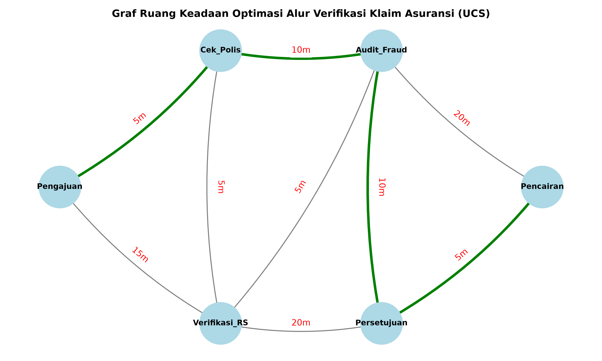

# Optimasi Alur Verifikasi Klaim Asuransi Kesehatan Cerdas (UCS)

Proyek ini merupakan implementasi agen cerdas berbasis algoritma **Uniform Cost Search (UCS)** untuk menentukan alur kerja (*workflow*) verifikasi klaim asuransi kesehatan paling efisien dengan total waktu operasional minimal.

## 📌 Studi Kasus
Prosedur Penjaminan *Cashless* Jaringan **Allianz-AdMedika**.

<p align="center">
  
</p>

## 🚀 Spesifikasi PEAS
- **Performance Measure**: Meminimalkan total waktu verifikasi (menit) & biaya operasional.
- **Environment**: Transaksi EDC AdMedika, database limit polis, Laporan Medis Awal RS, dan tabel tarif perawatan.
- **Actuators**: Penerbitan Surat Persetujuan Jaminan (*Guarantee Letter*) & otorisasi pembayaran.
- **Sensors**: Pembaca kartu EDC AdMedika, portal input rekam medis RS, dan *Medical Hotline Log*.

## 🛠️ Cara Menjalankan Program

1. Pastikan manajer paket **Astral `uv`** sudah terinstal.
2. Eksekusi skrip utama melalui terminal VS Code:
   ```powershell
   uv run src/main.py